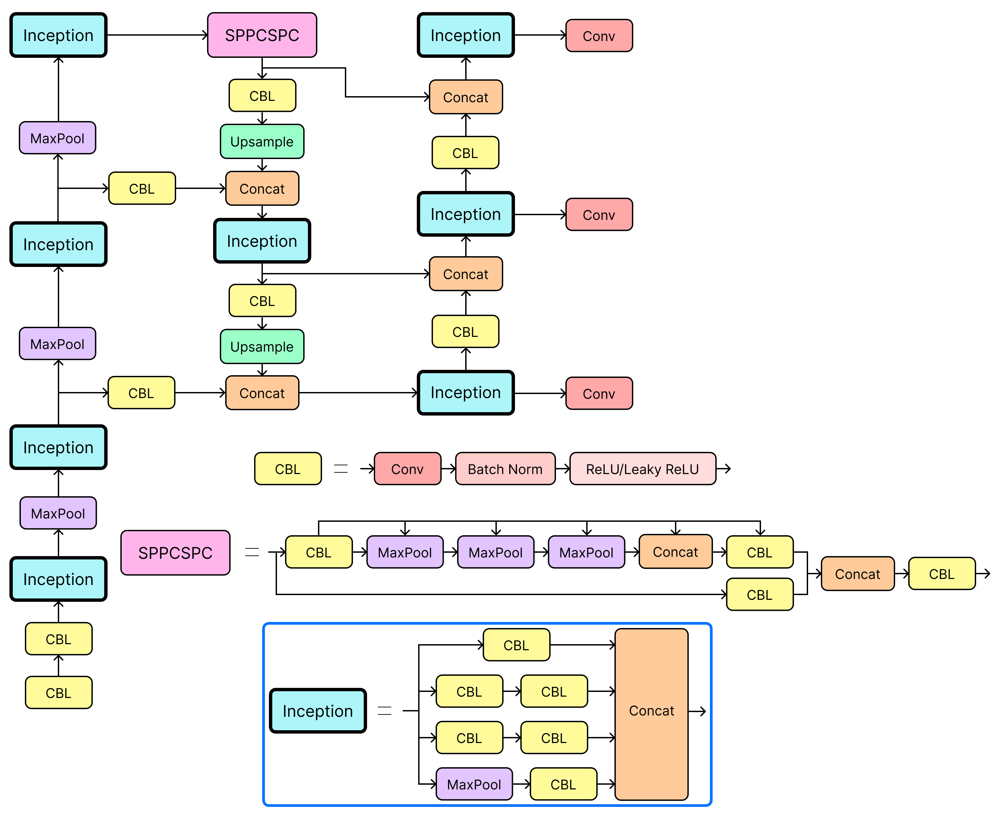

# Architecture

# Reference
- Wang, Chien-Yao, Alexey Bochkovskiy, and
Hong-Yuan Mark Liao. "YOLOv7: Trainable
bag-of-freebies sets new state-of-the-art for
real-time object detectors." Proceedings of the
IEEE/CVF conference on computer vision and pattern
recognition. 2023.
- https://github.com/WongKinYiu/yolov7
- Szegedy, Christian, et al. "Going deeper with
convolutions." Proceedings of the IEEE conference
on computer vision and pattern recognition. 2015.
- SIH, “Indoor Fire Detection Dataset”, Roboflow
Universe, 2023. https://universe.roboflow.com/sih-hisa
v/indoor-fire-detection